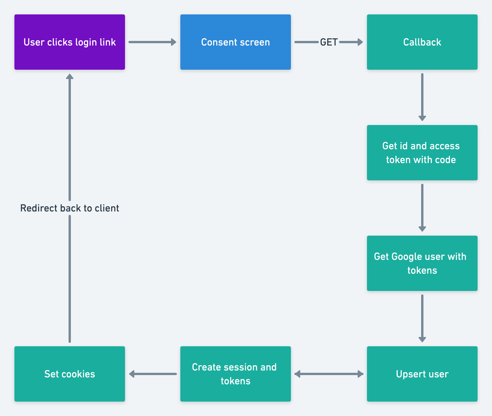

# Google Oauth

## What will I lean?
* How to get Google OAuth API keys
* How OAuth works
* How to build an OAuth implementation with Node.js

## What will we not be using?
* Passport
* googleapis npm package

## Let's keep in touch
- [Linkedin](https://www.linkedin.com/in/tirathsharma/)
